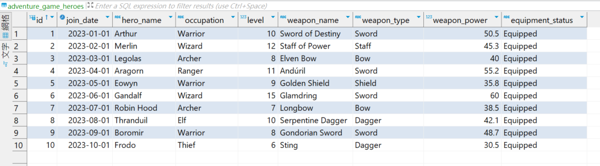
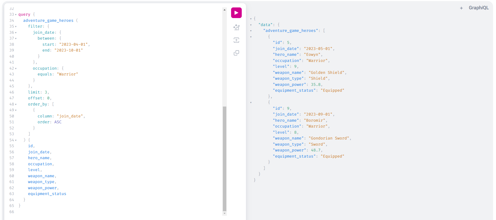

# Dynamic Schema GraphQL Django

define Doris table schema in yaml and fetch data in GraphiQL.  


## Overview

- Language: Python v3.12
- Web FrameWork: Django v4.1


### ENV

etc/database.yaml
```
host: localhost
name: database
user: root
password: password
port: 9030
```

etc/schema.yaml  
enabled data type: String, Integer, Double, Date
```
tables:
  - name: adventure_game_heroes
    fields:
      - name: id
        type: Integer
      - name: hero_name
        type: String
      - name: occupation
        type: String
      - name: level
        type: Integer
      - name: weapon_name
        type: String
      - name: weapon_type
        type: String
      - name: weapon_power
        type: Double
      - name: equipment_status
        type: String
      - name: join_date
        type: Date
```

### Example Data

adventure_game_heroes.sql




## Run

### Run Docker
```
docker compose up -d
```

### Run Local

```
poetry install
```

activate poetry environment  
windows: click .venv/Scripts/activate.bat  


```
python manage.py runserver
```

UI
```
localhost:8000  
```

enabled filter
```
"equals": value, 
"greaterThan": value, 
"greaterThanOrEquals": value,
"lessThan": value, 
"lessThanOrEquals": value, 
"between": {"start": value, "end": value}
```



Swagger
```
localhost:8000/swagger-ui  
```